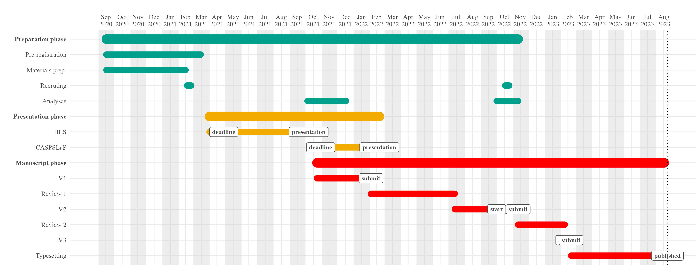

# Production, perception, and processing of prosody in second language acquisition

The purpose of this project is to study the production, perception, and processing of prosody in second language acquisition. This research looks at the role of individual pragmatic skills in the process of learning a new language. Specifically, we look at the role of empathy in the development of L2 prosody by analyzing the perception of intonation in questions and statements in L2 Spanish.

## Project timeline

- Project start: 2020-09-16
- Initial submission: 2022-02-03
- Decision: 2022-07-13, revise and resubmit, major revisions 
- Begin r1 revisions: 2022-10-01
- Submit V2: 2022-11-11




## Contributor roles


## Basic organization

```{r, 'proj-structure', comment=NA, echo=F}
fs::dir_tree(recurse = 1, glob = "*.Rmd|*.md|*.Rproj", invert = T)
```
