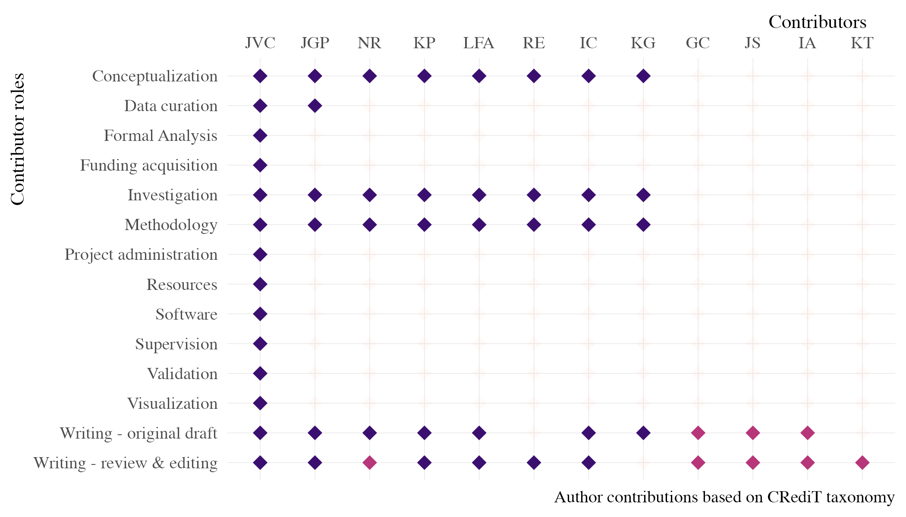

# Production, perception, and processing of prosody in second language acquisition

The purpose of this project is to study the production, perception, and
processing of prosody in second language acquisition. This research
looks at the role of individual pragmatic skills in the process of
learning a new language. Specifically, we look at the role of empathy in
the development of L2 prosody by analyzing the perception of intonation
in questions and statements in L2 Spanish.

## Project timeline

## Contributor roles

## Basic organization

    .
    ├── LICENSE
    ├── data
    │   ├── raw
    │   └── tidy
    ├── docs
    │   ├── Brandl et al. Stimuli
    │   ├── irb
    │   ├── lit
    │   ├── manuscript
    │   ├── pre_reg
    │   └── templates
    ├── exp
    │   ├── empathy_intonation_perc
    │   ├── empathy_intonation_perc_sp
    │   └── text_stim_for_audio
    ├── figs
    │   ├── project_contributors.pdf
    │   ├── project_contributors.png
    │   ├── project_timeline.pdf
    │   └── project_timeline.png
    ├── models
    └── scripts
        ├── praat
        └── r
