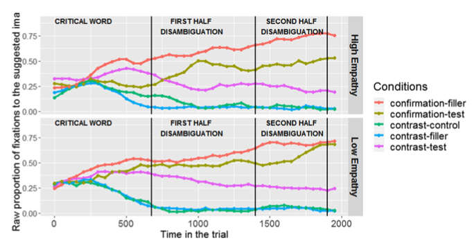

```{r setup, include=FALSE}
options(htmltools.dir.version = FALSE)
```

```{r, 'source-libs', message=F, echo=F}
source(here::here("scripts", "r", "12_small_data.R"))
library("fontawesome")
library("RefManageR")
```

```{r, 'bib-setup', echo=F, warning=F, message=F}
BibOptions(check.entries = FALSE,
           bib.style = "authoryear",
           cite.style = "authoryear",
           style = "markdown",
           hyperlink = FALSE,
           dashed = FALSE)
bib <- ReadBib(here("docs", "bib", "empathy.bib"), check = FALSE)
```

class: center
count: false

# <br><br>.grey[Pre-registered on OSF] 

### https://osf.io/dg64r

<div>


</div>

???

This project is pre-registered

This means there is a time-stamped document stating all of the RQs and hypotheses before data collection took place

This project is still ongoing, so once it has been completed all the data and materials will be available on the OSF project page

---
exclude: true

# Summary 

- The present study investigates the interplay between proficiency and individual pragmatic skills in the process of learning a new language. 
- We focus on the role of empathy in the development of second language (L2) prosody by analyzing the perception and processing of intonation in questions and statements in L2 Spanish. 
- It is common for L2 learners to struggle with L2 intonation, often resulting in comprehension and communication difficulties [@trofimovich2006learning]. 
- Previous research attests that learners gradually acquire target-language prosody as they gain proficiency in the language. 
- Concretely, the perception and processing of L2 intonation has been shown to improve in conjunction with proficiency conditional on intonation type [@bustin_2020], with polar ('yes/no') interrogatives being more difficult to process and acquire when compared with simple statements. 
- The construct empathy has been shown to influence native language processing in how listeners interpret intonation and meaning when words are ambiguous [@esteve2020empathy]. 
  - higher empathy individuals, in comparison with lower empathy individuals, appear to be more sensitive to intonation cues in the process of forming sound-meaning associations. 
- We extend this research to L2 acquisition in order to determine if individual differences in pragmatic skills affect the development of intonation in L2 processing and sentence comprehension.


The stimuli were randomly drawn tokens of declarative (broad, narrow focus) and interrogative (polar, wh-) sentences, spoken by native speakers of eight distinct varieties of Spanish (Andalusian, Argentine, Castilian, Chilean, Cuban, Mexican, Peruvian, Puerto Rican). 
The stimuli were presented aurally to the participants and subsequently identified as questions or statements using a keyboard. 
Additionally, participants completed the LexTALE vocabulary task in Spanish [@izura2014lextale], which served as a proxy for L2 proficiency, as well as the Empathy Quotient questionnaire in English [@baron2004empathy], which provided an individual assessment of the construct empathy. 

We used Bayesian multilevel regression and Drift Diffusion models to analyze the 2AFC data as a function of proficiency and empathy scores. 
Proficiency and empathy were used as continuous predictors to assess their relationship with pragmatic skill.
The results replicated findings from @bustin_2020 showing that learner response accuracy improved as a function of proficiency for all utterance types. Importantly, higher empathy scores were positively correlated with higher accuracy in identifying polar interrogatives (see Figure \ref{fig:plot-2panel-emp-prof}).
As is the case with L1 research, the present project underscores the importance of considering individual pragmatic differences when examining intonational meaning processing and sentence comprehension in an L2. 
More notably, the results also motivate the inclusion of measures of pragmatic skill, such as empathy, as predictors for L2 acquisition outcomes. 
Furthermore, these findings highlight an area in which models of L2 development can improve in order to better account for individual differences in L2 learning.


---
background-image: url(https://raw.githubusercontent.com/jvcasillas/media/master/linguistics/img/production_1.png), url(./libs/img/tune.png)
background-size: contain, contain
background-position: -60% 0%, 50% 50%

???

- So we know that intonation (tune, melodic pattern of a sentence) can indicate many things, like syntactic structure, sentence type, focus, affective meaning, etc.

- And that it's realization is language-specific, dialect-specific

---
class: middle

### Learners often struggle with L2 intonation, </br> resulting in comprehension and communication<br> difficulties `r Citep(bib, "trofimovich2006learning")`

???

- We also know that L2 learners can struggle with L2 intonation, often resulting in comprehension and communication difficulties `r Citep(bib, "trofimovich2006learning")`

--

background-image: url(https://raw.githubusercontent.com/jvcasillas/media/master/teaching/gifs/confused.gif)
background-size: 450px
background-position: 95% 50%

???

- It can be an indicator of L2 accent

- We have probably all had the experience where we misinterpreted somebody else's intonation in our non-native languages

- Or maybe we aren't sure if somebody is asking a question or not

---
background-image: url(https://static01.nyt.com/images/2018/02/01/arts/01APBIO/01APBIO-superJumbo.jpg)
background-size: contain

<!-- ap bio image -->

???

- Ironically, intonation is not generally taught in the L2 classroom 

- Unsurprisingly it is one of the last aspects of l2 phonology for learners to acquire

---

# Background

<br>

.big[
- L2 intonation patterns acquired gradually as proficiency increases and native-like perception seems possible
]

???

Focusing on perception of Spanish, we know that L2 intonation patterns seem to be mastered gradually, as proficiency increases

Moreover, there is ample evidence that highly proficient adult learners perform as well as native speakers

--

.big[
- Sentence-type matters
  - statements easier than questions
  - wh- easier than y/n
]

???

The initial difficulties that learners face seem to deal with the type of utterance they hear... or more concretely the intonation pattern associated with it

the extant literature shows that statements are generally easier than questions, and specifically, partial interrogatives (wh- questions) appear to be easier than absolute interrogatives (y/n questions)

--

.big[
- Familiarity matters
]

.footnote[(Nibert, 2005; Trimble, 2013; Brandl et. al 2020)]

???

Furthermore, familiarity with the variety also seems to be important, which makes since given that intonational contours for a given utterance type can vary from variety to variety

---
background-image: url(https://www.psychalive.org/wp-content/uploads/2017/01/Empathy-300x200.png)
background-size: 450px
background-position: 95% 50%

# Empathy

### The construct

.pull-left[
.full-width[
.content-box-blue[
.large[
- Relies on inferring the intentions, understanding the feelings, and emotions of others

- Associated with Theory of Mind and perspective-taking

- Has been used as a measure to tap into individual pragmatic skills
]
]
]
]

.footnote[
(Carruthers, 2009; Baron-Cohen & Wheelwhright, 2004; Baron-Cohen, 2011; Frith & Frith, 2003; Meltzoff, 2004)
]

???

Now, changing gears just slightly, I am going to talk about the construct *empathy*

It's one of those things that intuitively we all seem to understand, but it's actually quite difficult to define

We know that it relies on inferring the intentions, understanding the feelings, and emotions of others

Research in psychology on *empathy* has associated it with Theory of Mind and the ability to take the perspective of somebody else

Recent studies have used this construct as a proxy to understanding individual pragmatic skill, particularly in research on autism

---

# Pragmatic skills

### The role of empathy

.pull-left[
.full-width[
.content-box-red[
- Individual empathic skills associated with use of intonation to infer meaning when words are ambiguous

- Better pragmatic skills (↑ empathy) = sensitive to intonation cues when forming sound–meaning associations

- Less pragmatically skills (↓ empathy) = need disambiguating material to select a referent
]
]
]

.pull-right[
```{r, esteve, echo=F}

```
.tiny[Esteve-Gibert et al. 2020]
]

???

Focusing on pragmatic skills, recent studies by Maria D'Imperio and colleagues have looked at the construct *empathy* in conjunction with sound-meaning associations

- To give a concrete example, in a visual world paradigm study, Esteve Gibert and colleagues used eye tracking methods to show that individual empathic skills are associated with monolingual listeners' use of intonation to infer meaning when words are ambiguous

- The study was quite clever. It was set up so that participants could anticipate a referent before disambiguating lexical information was available, but they had to do this by inferring either a contrast meaning or a confirmatory meaning from the intonation contour alone

- They found that listeners with better pragmatic skills (↑ empathy) were sensitive to intonation cues when forming sound–meaning associations

- Less pragmatically skilled listeners (↓ empathy) needed the disambiguating material that came later in the time course to accurately select a referent

---
class: center, middle
background-color: black

# The big picture

???

We investigate the interplay between proficiency and individual pragmatic skills in the process of learning a new language

Specifically, we focus on the role of empathy in the development of second language (L2) prosody by analyzing the perception and processing of intonation in questions and statements in L2 Spanish (conceptual replication of `r Citet(bib, "bustin_2020")`)

Importantly, we extend linguistic research on empathy to L2 acquisition in order to determine if individual differences in pragmatic skills affect the development of intonation in L2 processing and sentence comprehension.

---
class: title-slide-section-grey, middle

# .RUred[Research questions]

.big[
.white[
.blue[RQ1]: Is perceptual development in L2 Spanish modulated by proficiency and intonation type (i.e., Brandl et al., 2020)?  

**Hypothesis**: Accuracy will increase and processing time will decrease as a function of proficiency and intonation type. 
Yes-no questions will present the most difficulty for L2 learners of Spanish, followed by wh- questions and declarative broad focus and narrow focus statements.
]
]

---
class: title-slide-section-grey, middle

# .RUred[Research questions]

.big[
.white[
.blue[RQ2]: Do pragmatic skills---specifically, empathy---modulate the rate of development in L2 prosody?  

**Hypothesis**: Prosodic development will occur sooner and at a faster rate in higher empathy individuals. 
]
]

???

In this operationalization, 'sooner' refers to lower proficiency levels in a cross-sectional design, that is, at an earlier developmental stage than lower empathy individuals.

---
class: title-slide-section-grey, middle

# .RUred[Research questions]

.big[
.white[
.blue[RQ3]: Does speaker variety affect perception accuracy and processing speed?  

**Hypothesis**: L2 learners will have most difficulty (lower accuracy, slower RTs) with the Cuban variety. 
]
]

???

Based on tentative findings from native speaker pilot data

---


class: title-slide-section-red, middle

# Method

---
background-image: url(https://raw.githubusercontent.com/jvcasillas/media/master/linguistics/img/perception_2.png)
background-size: 150px
background-position: 90% 20%

# Method

### Participants

.large[
- We recruited `r n_learners` participants for a two-alternative </br> forced choice (2AFC) task 
- Adult L2 Spanish learners (L1 English) 
- From the Northeastern United States 
]

???

Participants were recruited online and were screened such English their L1, they started learning Spanish at the age of 13 or older?, and did not have significant knowledge of any languages other than English and Spanish

--

### Proficiency

.large[
- All participants completed LexTALE-ESP<sup>1</sup>
- Lexical decision task, assessment of vocab size/proficiency
- x&#772; &equals; 
`r lt_dat$mean_lt$val` &pm;
`r lt_dat$sd_lt$val` SD, range [
`r lt_dat$min_lt$val`, `r lt_dat$max_lt$val`]
]

.footnote[<sup>1</sup>`r Citet(bib, "izura2014lextale")`]

???

Lexical Test for Advanced Learners of Spanish as a standardized assessment of 
participants' proficiency/vocabulary size in Spanish.

scores can range from &minus;20 to 60, with native speaker values generally 
found between 50-60.

Individuals with little or no knowledge of Spanish typically score from 
&minus;20 to 0.

proficiency is treated as a continuous variable, thus we consider a 
monolingual English speaker to have little to no proficiency in Spanish.

---
background-image: url(https://raw.githubusercontent.com/jvcasillas/media/master/linguistics/img/perception_2.png)
background-size: 150px
background-position: 90% 20%

# Method

### Empathy

.big[
- All participants completed the Empathy Quotient (EQ) questionnaire<sup>1</sup>
- Lykert-type self-report scale
- 40 items, 20 distractors
- Max score = 80 (high empathy)
- Min score = 0 (low empathy)
- x&#772; &equals; 
`r eq_dat$mean_eq$val` &pm;
`r eq_dat$sd_eq$val` SD, range [
`r eq_dat$min_eq$val`, `r eq_dat$max_eq$val`]
]

.footnote[<sup>1</sup> `r Citet(bib, "baron2004empathy")`]

---

# Method

### 2AFC

.pull-left[
.large[
- Participants presented auditory stimuli
- "Is it a question?"
- Keyboard response (1 = "yes", 0 = "no")
- 4 utterance types (n = 64)<sup>1</sup>
  - Declarative broad focus
  - Declarative narrow focus
  - Absolute interrogative (y/n)
  - Partial Interrogative (wh-)
]
]

.pull-right[
.large[
- 8 speaker varieties
  - Castillian (F)
  - Mexican (F)
  - Chilean (F)
  - Andalusian (F)
  - Peruvian (M)
  - Argentine (M)
  - Puerto Rican (F)
  - Cuban (F)
- Stimuli drawn randomly in single block
- Speaker variety also randomized (.125 prob)

]
]

.footnote[<sup>1</sup>.grey[`r Citet(bib, "bustin_2020")`]]

---

# Method

### Procedure

.big[

- Single experimental session
  1. 2AFC
  2. LexTALE task
  3. Empathy quotient
]

.big[
- Experiments run in PsychoPy3 .lightgrey[(Peirce et al., 2019)] `r NoCite(bib, "Peirce:2019")`

- Participants recruited via Prolific.ac

- Median time to completion (all tasks): `r round(t_median)` minutes

]

---

# Method 

### Statistical analysis

- Bayesian multilevel regression model fitted in `stan` using `brms` 
.lightgrey[`r Citep(bib, "R_brms_a")`]

- Responses accuracy, 0 = incorrect, 1 = correct

- Modeled as a function of *LexTALE score*, *empathy quotient*, and all higher order interactions

- Continuous predictors standardized 

- Nested group-level effects:
  - participant
  - speaker_variety/sentence_type
  - sentence_type
  - item

- 2000 iterations (1000 warm-up), 16 processing cores 

- Regularizing, weakly informative priors .lightgrey[`r Citep(bib, "Gelman_2017")`]

---
class: title-slide-section-red, middle

# Results

---
background-image: url(../../../figs/slides/learner_accuracy_by_utterance_type.png)
background-size: 95%

---
background-image: url(../../../figs/slides/lextale_combine_1.png)
background-size: contain

---
background-image: url(../../../figs/slides/lextale_combine_2.png)
background-size: contain

---
background-image: url(../../../figs/slides/empathy_combine_1.png)
background-size: contain

---
background-image: url(../../../figs/slides/empathy_combine_2.png)
background-size: contain

---
background-image: url(../../../figs/slides/lt_eq_3way_ce_1.png)
background-size: contain

---
background-image: url(../../../figs/slides/lt_eq_3way_ce.png)
background-size: contain

---
background-image: url(../../../figs/slides/learner_accuracy_by_speaker_variety.png)
background-size: 95%

---

# Review

???

- We presented audio stimuli to adult L2 learners of Spanish
- The stimuli were questions and statements from 8 different varieties 
- The participants' task was simple. We asked: "Is this a question?" and they responded "yes" or "no"

--

.Large[
.blue[RQ1]: Is perceptual development in L2 Spanish modulated by proficiency and intonation type (i.e., Brandl et al., 2020)?
]

### Yes. 

.big[

- Proficiency positively correlated with response accuracy
- Proficiency &times; utterance type interaction

]

.large[

|               |                        |                |
| :------------ | :--------------------: | -------------: |
|               | Statements → Questions |                |
| .blue[Easier] .white[........] | | .white[........] **Harder** |
| | broad focus → narrow focus → wh- → y/n | |

]

???

RQ1: Is perceptual development in L2 Spanish modulated by proficiency and intonation type (i.e., Brandl et al., 2020)?  
**Hypothesis**: Accuracy will increase and processing time will decrease as a function of proficiency and intonation type. 
Yes-no questions will present the most difficulty for L2 learners of Spanish, followed by wh- questions and declarative broad focus and narrow focus statements.

---

# Review

.big[

.blue[RQ2]: Do pragmatic skills&mdash;specifically, empathy&mdash;modulate the rate of development in L2 prosody?

### Probably. 

- Evidence for 3-way interaction
  - ↑ empathy quotient associated with increased accuracy for all utterance types except y/n questions
  - Particularly true for intermediate/advanced learners
]

.big[

- Cross-sectional design suggests ↑ empathy individuals may progress at ealier stage of L2 development

]

???

RQ2: Do pragmatic skills---specifically, empathy---modulate the rate of development in L2 prosody?
**Hypothesis**: Prosodic development will occur sooner and at a faster rate in higher empathy individuals. 

---

# Review

.big[

.blue[RQ3]: Does speaker variety affect perception accuracy and processing speed?  

]

### Yes! (for accuracy)

.big[

- Response accuracy was highest for Castilian variety (most familiar)

- Response accuracy was lowest for Cuban variety for L2 learners and monolingual Spanish speakers

]

???

RQ3: Does speaker variety affect perception accuracy and processing speed?  
**Hypothesis**: L2 learners will have most difficulty (lower accuracy, slower RTs) with the Cuban variety. 


---

# Discussion

.pull-left[
.full-width[
.content-box-red[

### Spanish intonation

- Our findings corroborate previous studies on intonational development in Spanish

  - Development in step with proficiency measures (i.e., Nibert, 2005, 2006; Brandl et al., 2020)

  - y/n question are most difficult (Trimble, 2013; Brandl et al., 2020)

  - Familiarity with variety affects accuracy (Trimble, 2013)

]
]
]

--

.pull-right[
.full-width[
.content-box-blue[

### Empathy as pragmatic skill

- We build on previous linguistic research incorporating the construct empathy

  - Empathy is associated with intonation-meaning mapping `r Citep(bib, "esteve2020empathy")`

  - Also true in SLA/bilingualism 

  - Extend association to language proficiency and intonation type

]
]
]

---
background-image: url(https://raw.githubusercontent.com/jvcasillas/media/master/rstats/memes/lm_correlation_not_causation.png)
background-size: 1200px

---
background-image: url(https://raw.githubusercontent.com/jvcasillas/media/master/teaching/img/think.png)
background-size: 350px
background-position: 95% 50%

# Discussion

### What about L2 phonology?

.large[
.pull-left[
- Models of L2 phonology (SLMr, PAM-L2, L2LP) don't focus on suprasegmentals

- Should account for extralinguistic constructs that correlate with development

- Growing body of evidence suggesting empathy is relevant variable

]
]

---

# Discussion

### Next steps

- This project
  - More advanced learners 
  - Drift diffusion models to include RTs and account for bias

- Future projects: 
  - Empathy in other domains
  - Segments
  - y/n questions?

---
background-image: url(https://acendahealth.org/wp-content/uploads/2021/02/empathy.jpg)
background-size: 450px
background-position: 95% 50%

# Conclusion

.large[
.pull-left[

- Individual empathic skills impact listeners' use of intonation to infer meaning in a second language

- Link between intonational form and pragmatic meaning is variety-specific in L2

- Models of L2 phonological acquisition need to take into account how learners process intonation-meaning mapping, particularly with regard to individual pragmatic skills 

]
]

???

- We extend linguistic research on empathy and intonation-meaning mapping to L2 acquisition

- Individual empathic skills impact listeners' use of intonation to infer meaning in a second language

- Link between intonational form and pragmatic meaning is variety-specific in L2

- Models of L2 phonological acquisition need to take into account how learners process intonation-meaning mapping, particularly with regard to individual pragmatic skills 

---
exclude: true

`r Citet(bib, "munro1995foreign")`


---
count: false
class: title-slide-final
background-image: url(https://github.com/jvcasillas/ru_xaringan/raw/master/img/logo/ru_shield.png), url(./libs/img/qr3.png), url(https://raw.githubusercontent.com/jvcasillas/hex_stickers/master/stickers/rap-group.png), url(https://edsurge.imgix.net/uploads/post/image/12460/empathy-1565029076.jpg?auto=compress%2Cformat&w=1600&h=648&fit=crop)
background-size: 100px, 150px, 130px, 350px
background-position: 15% 50%, 50% 50%, 85% 50%, 50% 50%

<br>

# Thank you!

<br><br><br><br><br><br><br><br><br><br><br>

.large[

|                                     |                                         |
| ----------------------------------: | :-------------------------------------- |
| `r fa("paper-plane", fill = "red")` | .lightgrey[joseph.casillas@rutgers.edu] |
| `r fa("twitter", fill = "red")`     | .lightgrey[@jvcasill]                   |

<!--
| `r fa("link", fill = "red")`        | .lightgrey[bit.ly/caspslap_2020]        |
-->

]

---

# References

```{r, results='asis', echo=FALSE, warning=FALSE}
PrintBibliography(bib, start = 1, end = 5)
```

---
count: false

# References II

```{r, results='asis', echo=FALSE, warning=FALSE}
PrintBibliography(bib, start = 6, end = 12)
```

---
class: title-slide-section-grey, middle
count: false

# Extras

---
count: false
background-image: url(../../../figs/slides/speech_rate.png)
background-size: 90%

---
count: false
background-image: url(../../../figs/slides/random_speaker_check.png)
background-size: 90%

---
count: false
class: middle

# Stimuli examples

.pull-left[
.full-width[
.content-box-blue[
Castilian

- Declarative, broad focus

<audio controls style="width: 120px;">
  <source src="./libs/wavs/castilian_match_declarative-narrow-focus_Maria-bebe-el-vino.ogg" type="audio/ogg">
  <source src="./libs/wavs/castilian_match_declarative-narrow-focus_Maria-bebe-el-vino.wav" type="audio/mpeg">
Your browser does not support the audio element.
</audio>

- Partial interrogative (wh- question)

<audio controls style="width: 120px;">
  <source src="./libs/wavs/castilian_match_interrogative-partial-wh_Por-que-ama-la-navidad.ogg" type="audio/ogg">
  <source src="./libs/wavs/castilian_match_interrogative-partial-wh_Por-que-ama-la-navidad.wav" type="audio/mpeg">
Your browser does not support the audio element.
</audio>

- Absolute interrogative (y/n question)

<audio controls style="width: 120px;">
  <source src="./libs/wavs/castilian_match_interrogative-partial-wh_Por-que-ama-la-navidad.ogg" type="audio/ogg">
  <source src="./libs/wavs/castilian_match_interrogative-partial-wh_Por-que-ama-la-navidad.wav" type="audio/mpeg">
Your browser does not support the audio element.
</audio>

]
]
]

.pull-right[
.full-width[
.content-box-red[
Cuban variety

- Declarative, broad focus

<audio controls style="width: 120px;">
  <source src="./libs/wavs/cuban_match_declarative-broad-focus_Maria-bebe-el-vino.ogg" type="audio/ogg">
  <source src="./libs/wavs/cuban_match_declarative-broad-focus_Maria-bebe-el-vino.wav" type="audio/mpeg">
Your browser does not support the audio element.
</audio>

- Partial interrogative (wh- question)

<audio controls style="width: 120px;">
  <source src="./libs/wavs/cuban_match_interrogative-partial-wh_Por-que-ama-la-navidad.ogg" type="audio/ogg">
  <source src="./libs/wavs/cuban_match_interrogative-partial-wh_Por-que-ama-la-navidad.wav" type="audio/mpeg">
Your browser does not support the audio element.
</audio>

- Absolute interrogative (y/n question)

<audio controls style="width: 120px;">
  <source src="./libs/wavs/cuban_match_interrogative-partial-wh_Por-que-ama-la-navidad.ogg" type="audio/ogg">
  <source src="./libs/wavs/cuban_match_interrogative-partial-wh_Por-que-ama-la-navidad.wav" type="audio/mpeg">
Your browser does not support the audio element.
</audio>

]
]
]


<style type="text/css">

/* H1 fonts */
.title-slide h1 {
  color: #cc0033;
  padding-top: 250px;
  font-weight: normal;
  font-size: 45px;
  text-align: left;
  text-shadow: none;
  padding-bottom: 18px;
  margin-bottom: 18px;
}

.remark-slide table {
  margin: auto;
  border: 0px none;
  border-collapse: collapse;
}
.remark-slide table thead th { 
  border: 0px none;
  background-color: none;
}

th, td { 
  padding: 5px;
  border: 0px none;
  background-color: none;
}

.remark-slide thead, .remark-slide tfoot, .remark-slide tr:nth-child(even) {
  border: 0px none;
  background: none;
}

ul.no_bullet {
  list-style-type: none;
  padding: 0;
  margin: 0;
}

li.prod {
  background: url(https://raw.githubusercontent.com/jvcasillas/media/master/linguistics/img/production_1.png) no-repeat;
  background-size: 95px 95px;
  display: block;
  padding: 0 50px 10px 150px;
}

li.perc {
  background: url(https://raw.githubusercontent.com/jvcasillas/media/master/linguistics/img/perception_1.png) no-repeat;
  background-size: 80px 95px;
  display: block;
  padding: 0 50px 10px 150px;
}

</style>
